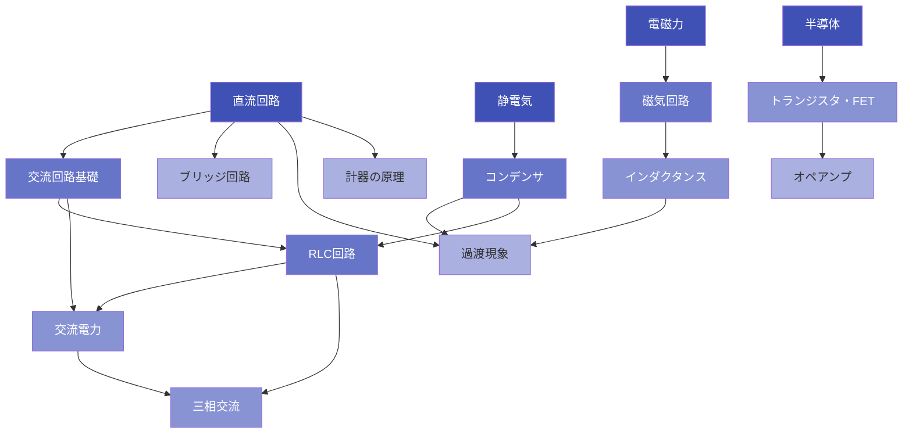

# 学習ロードマップ

理論科目は、法規と違い「テーマ間の依存関係」が強い。直流回路を理解せずに交流に進むと詰まり、
交流を理解せずに電磁気に進むと暗記頼みになる。このロードマップでは依存関係を明示し、
「正しい順番で積み上げる」学習設計をサポートする。

---

## 3つの学習パス

| パス | 対象 | 期間目安 |
|---|---|---|
| [初学者パス](beginner.md) | 理論をゼロから始める方 | 3〜4ヶ月 |
| [過去問逆引きパス](by-weakness.md) | 弱点テーマを集中強化したい方 | 随時 |
| [直前確認パス](last-minute.md) | 試験2〜4週前の総仕上げ | 2〜4週間 |

---

## 16テーマの依存関係

理論16テーマには学習上の依存関係がある。フェーズ順に進むと、前提知識が積み上がった状態で
各テーマに入れる。



> 矢印は「→ の元テーマを理解してから進む」ことを推奨する依存関係。
> 濃い色（🟦）= Phase 1-2の基礎テーマ。薄い色（🟪）= Phase 3-4の応用テーマ。

### Phase 1 — 基礎固め

依存関係なし。最初に固める土台。電気回路の根幹を形成する。

```
直流回路 → 静電気 → コンデンサ → ブリッジ回路
```

### Phase 2 — 交流の世界（直流回路が前提）

複素数・フェーザーが登場する最初の壁。直流回路の理解があると吸収が早い。

```
交流回路基礎 → RLC回路 → 交流電力 → 三相交流 → 過渡現象
```

### Phase 3 — 電磁気の深化（RLC回路が前提）

インダクタンスの概念はRLC回路の延長。磁気回路は電気回路との対応関係で理解する。

```
電磁力 → 磁気回路 → インダクタンス
```

### Phase 4 — 電子理論・計測

半導体・トランジスタ・オペアンプは独立性が高い。計器の原理は直流・交流の基礎があれば
単独で学べる。

```
半導体 → トランジスタ → オペアンプ
計器の原理（独立して学べる）
```

---

## テーマ一覧（分野別リンク）

### 電気回路

| テーマ | リンク |
|---|---|
| 直流回路 | [→ 直流回路](../themes/chokuryu-kairo.md) |
| 交流回路基礎 | [→ 交流回路基礎](../themes/kouryu-kiso.md) |
| RLC回路 | [→ RLC回路](../themes/rlc-kairo.md) |
| 交流電力 | [→ 交流電力](../themes/kouryu-denryoku.md) |
| 三相交流 | [→ 三相交流](../themes/sansou-kouryu.md) |
| 過渡現象 | [→ 過渡現象](../themes/kato-gensho.md) |
| ブリッジ回路 | [→ ブリッジ回路](../themes/bridge.md) |

### 電磁気

| テーマ | リンク |
|---|---|
| 静電気 | [→ 静電気](../themes/seidenki.md) |
| コンデンサ | [→ コンデンサ](../themes/condenser.md) |
| 電磁力 | [→ 電磁力](../themes/denjiryoku.md) |
| 磁気回路 | [→ 磁気回路](../themes/jiki-kairo.md) |
| インダクタンス | [→ インダクタンス](../themes/inductance.md) |

### 電子理論・電気計測

| テーマ | リンク |
|---|---|
| 半導体 | [→ 半導体](../themes/handotai.md) |
| トランジスタ | [→ トランジスタ](../themes/transistor.md) |
| オペアンプ | [→ オペアンプ](../themes/opamp.md) |
| 計器の原理 | [→ 計器の原理](../themes/keiki.md) |

---

## どのパスで学ぶか迷ったら

**合格を最短で目指すなら → [初学者パス](beginner.md)**
- 全16テーマをフェーズ順に一周する
- 週10〜15時間確保できる人向け

**過去問を解いて間違えたテーマを潰すなら → [過去問逆引きパス](by-weakness.md)**
- 「問題のキーワード → 対応テーマ」の対応表ですぐ特定できる
- ある程度学習が進んでいる人向け

**試験が迫っていて確認だけしたいなら → [直前確認パス](last-minute.md)**
- 16テーマの「5秒で思い出す」キャッチフレーズを一覧で確認
- 試験前日〜当日朝の最終確認用

!!! tip "学習効率を上げるコツ"
    各テーマを学んだ後は「フェインマン [テーマ名]」コマンドで理解度を確認。
    スコア4以上になったら次のテーマへ進む。
    スコアが低いテーマは「知識チェック」コマンドで復習スケジュールに組み込む。
